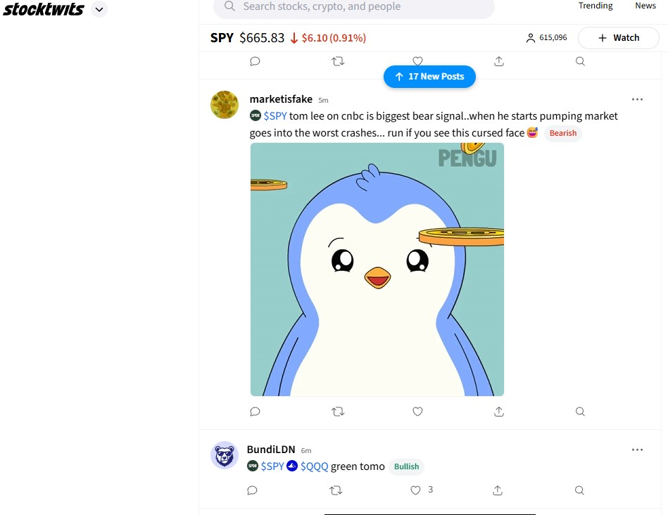
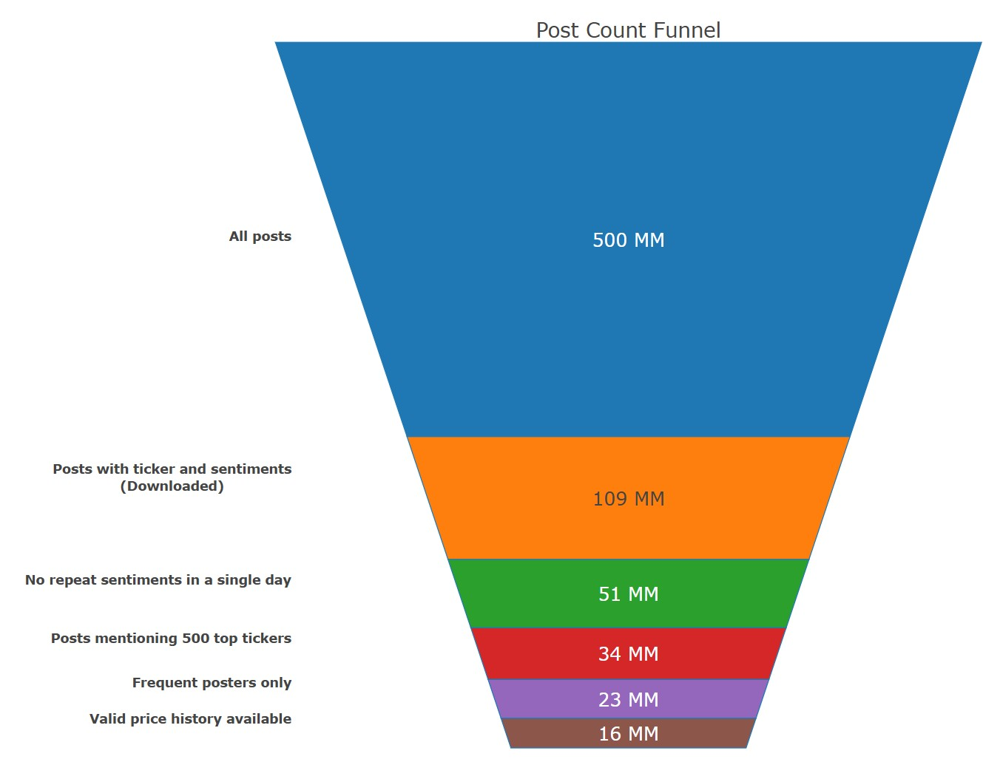
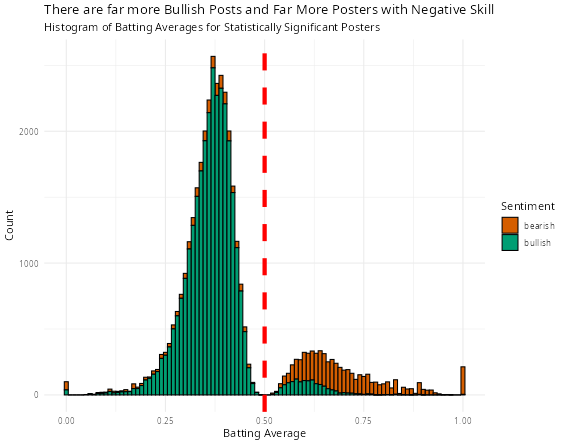
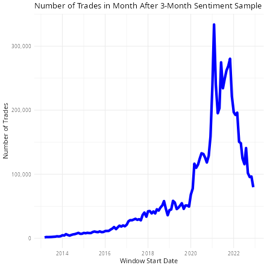
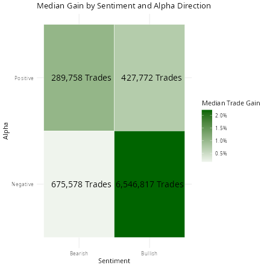
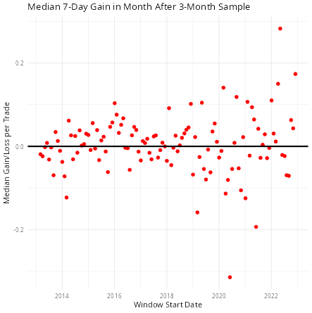
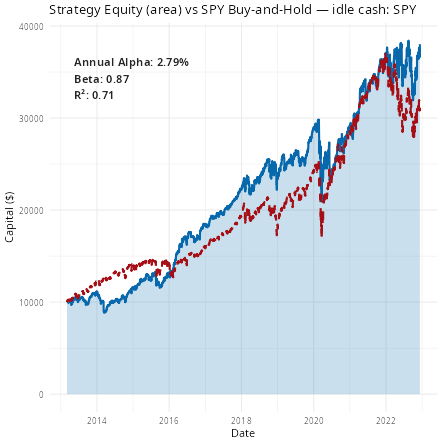

## Goals

-   Learn how to manage large datasets with R and duckplyr.
-   Learn how to potentially profit from social media posters being reliably wrong.

## Who I Am

-   Husband, Father, Grandfather (I have my priorities straight)
-   Retired Investment Professional (Global Macro Fixed Income)
-   Fund Board Member at BlackRock
-   Consultant for Posit
-   Data Science Hobbyist
-   Blogger at `outsiderdata.net`

## Background

-   Picking stocks that will go up is hard.
-   Picking stocks that will go down also is hard.
-   Being skilled at either could make you a lot of money.
-   **But what if we could find people who are reliably wrong?**

## Social Media Sentiment Analysis

-   A recent academic paper presented a huge dataset. *"StockTwits: Comprehensive records of a financial social media platform from 2008 to 2022."[@Li_Al_Ansari_Kaufman_2025]*
-   The complete dataset is freely available on AWS S3, over 500 million posts!
-   Of the posters, the researchers found "**a significant percentage consistently perform statistically better or worse than guessing, especially at longer timescales.**"

\newpage

## What is StockTwits?

-   This is what Copilot suggested I say: "StockTwits is a social media platform designed for sharing ideas between investors, traders, and entrepreneurs.""

-   This is what I say: "StockTwits is Twitter for randos to hype meme stocks...with memes."

    {fig-align="center" width="400"}


## The Plan

-   Download symbol_sentiment CSV files of the StockTwits dataset from AWS S3.
-   Filter the dataset down to useful posts.
-   Download matching stock price data from Yahoo Finance.
-   Calculate 7-day forward returns after each message.
-   Filter for statistically significant batting averages.
-   Develop a trading strategy.

\newpage

## From 500 Million Down To 16 Million Posts

{fig-align="center" width="700"}

\newpage

## Managing The Data

-   The R dplyr package is great a manipulating large data frames but is designed for in-memory usage.

-   Manipulating very large data sets is best done with a database package that works with connections to those data sets, wherever they reside.

-   We will use the super-fast **DuckDB** for R (Python users should consider Polars).

## Managing The Data (cont.)

-   DuckDB has a dplyr frontend called **duckplyr** where most dplyr verbs are implemented.

-   We'll save and retrieve (connect to) files in **Parquet** format which, like duckDB, is column-oriented.

-   **Differences in syntax are almost invisible but speed advantage is enormous.**

\newpage

## duckDB Is SQL-based....

```{r SQL demo}
# Find the largest sepals/petals in the Iris data set
library(duckdb)

con <- dbConnect(duckdb())
duckdb_register(con, "iris", iris)

query <- r'(
    SELECT count(*) AS num_observations,
    max("Sepal.Width") AS max_width,
    max("Petal.Length") AS max_petal_length
    FROM iris
    WHERE "Sepal.Length" > 5
    GROUP BY ALL
    )'

dbGetQuery(con, query)
```

## ... But You Don't Have To Learn SQL

```{r duckPlyr demo}
# Find the largest sepals/petals in the Iris data set using duckplyr
library("duckplyr")

iris |>
    filter(Sepal.Length > 5) |>
    summarize(.by = Species,
        num_observations = n(),
        max_width = max(Sepal.Width),
        max_petal_length = max(Petal.Length),
        na.rm = TRUE) |>
    collect()
```

## duckplyr Key Points

-   Chains of multiple verbs are only evaluated when `collect()` or `as_tibble()` is called, even when the data remains on disk and not in memory.
-   Not all verbs are implemented, but duckplyr automatically falls back to dplyr when needed.
-   Have a strategy around when to "materialize" data.

## Downloading the Data is Easy!

-   We are only interested in files containing the user ID, timestamp, symbol and sentiment columns.
-   This 100-million-row subset is stored as 34 CSV files in an AWS S3 bucket.
-   Fetching took about 25 seconds per file on my machine.
-   Once downloaded, we can treat the entire dataset on disk as a single data frame.

\newpage

## Downloading the Data is Easy (code)

```{r Load Data}
library(tidyverse)
library(duckplyr)

db_exec("INSTALL httpfs;")
db_exec("LOAD httpfs;")
db_exec("SET s3_region='us-west-2';")

base_url <- "https://stocktwits-nyu.s3.amazonaws.com/dataset/v1/data/csv/"
dataset <- "symbol_sentiments"
file_nums <- sprintf("%02d", 0:33)
S3_file_list <- paste0(base_url, dataset, "/",dataset, "_", file_nums, ".csv")
local_file_list <- paste0("data/", dataset, "_", file_nums, ".parquet")

for (n in 1:length(S3_file_list)) {
  df <- read_csv_duckdb(S3_file_list[n]) |>
    compute_parquet(local_file_list[n]) }

# ALL SET! Read all parquet files and off you go - instantly!
sentiments <- read_parquet_duckdb(local_file_list)
```

## Understand what materialization means

```{r Materialization Demo}
# This gets the answer almost instantly.
sentiments |> summarise(total_rows = n())
# A duckplyr data frame: 1 variable
#   total_rows
#     <int>
#1 106105966

# This is bad
sentiments |> nrow()
# Error:
# ! Materialization would result in more than 250000 rows.
# Use `collect()` or `as_tibble()` to materialize.
```

## No More Code Today. Just *RESULTS!*

-   Refer to my GitHub repository for all the analytic code and details.
-   <https://github.com/apsteinmetz/stocktwits>

## The Cleaned Data

```{r}
#| eval: true
#| echo: false
library(duckplyr)
library(gt)
sentiments <- read_parquet_duckdb("data/sentiments_filtered.parquet")
slice_head(sentiments, n = 10) |> 
  collect() |> 
  gt::gt() |> 
  # add title
  gt::tab_header(
    title = "Sample StockTwits Posts After Cleaning and Filtering"
  )
```

## What are the most popular Tickers?

No surprise, megacaps, meme stocks, and SPY.

```{r Most Popular Tickers}
#| echo: false
#| eval: true
library(duckplyr)
library(gt)
popular_tickers <- read_parquet_duckdb("data/popular_tickers.parquet")
head(popular_tickers,n=10) |> 
  gt::gt() |>  
  # add title
  gt::tab_header(
    title = "Most Popular StockTwits Tickers"
  ) |> 
  gt::fmt_number(
    columns = c(count),
    decimals = 0
  )
```

\newpage

## Zipf's Law - Stocktwits Like to Pile On

```{r Zipfs Law}
#| eval: true
#| warning: false
#| message: false
#| echo: false
# show popular tickers on a log/log frequency plot
library(ggplot2)
library(duckplyr)
popular_tickers <- read_parquet_duckdb("data/popular_tickers.parquet") |>
  as_tibble() |>
  arrange(desc(count)) |>
  mutate(rank = row_number())

popular_tickers |>
  ggplot(aes(x = rank, y = count)) +
  geom_point() +
  scale_x_log10(limits = c(1, 1000)) +
  scale_y_log10(labels = scales::comma) +
  # add labels for top 10 tickers
  geom_text(
    data = popular_tickers |> slice_head(n = 10),
    aes(label = ticker),
    vjust = -1,
    size = 3
  ) +
  geom_smooth(method = "lm", se = FALSE, color = "blue") +
  labs(
    title = "Popularity Begets Popularity",
    subtitle = "Rank Frequency Plot of Top 500 StockTwits Ticker Mentions",
    x = "Rank of Ticker by Mentions (log scale)",
    y = "Number of Mentions (log scale)"
  )

```

## Get Prices For Most Popular Tickers

-   We the `yahoofinancer` package to download historical OHLC prices from Yahoo Finance.
-   Other download packages are available, e.g. `quantmod`, `tidyquant`, `yfR`.
-   Some tickers don't have valid prices histories aligned with our sentiment data. We'll ignore them.

\newpage

## Build Track Records

-   Map each post to the adjusted close price on the post date and the price 7 days later.
-   Test whether the return and return vs. SPY align with sentiment

```{r}
#| eval: true
#| echo: false
read_parquet_duckdb("data/track_record_sample.parquet") |>
  collect() |>
  head(5) |> 
  gt::gt() |>
  # add title
  gt::tab_header(
    title = "Sample Track Records"
  )
```

## Calculate Batting Averages

-   For each ticker, calculate the batting average (percent correct) for buy and sell posts.

```{r}
#| eval: true
#| echo: false
read_parquet_duckdb("data/win_rate_sample.parquet") |>
  slice_head(n = 5) |>
  collect() |>
  gt::gt() |>
  # add title
  gt::tab_header(
    title = "Sample Batting Averages"
  ) |> 
  #format win_rate as percent
  gt::fmt_percent(
    columns = c(win_rate),
    decimals = 0
  )
```

\newpage

## Stocktwits Are Usually Wrong

- Of 68,183 posters with track records, 37,767 had statistically significant batting averages at the 5% level (p \< 0.05).

- Of those, the alpha direction was negative for 83%. 



## Develop Trading Strategy

-   Divide posts into 3 month samples Test for significant posters in the window.

-   During the 1 month following out of sample, follow sentiment from positive alpha poster, and do the opposite from a negative alpha poster. Reverse the trade 7 days later.

-   Deploy uninvested cash in SPY ETF.

\newpage

## This Generates a LOT of trades

Feasible for a quant shop, not us.



## Too Bad. The Gains Look Impressive



## Develop Realistic Strategy for the Small Investor

-   Limit trade volume to first 100 signals per month.

-   Equal weight each trade.

-   Long only. Note that includes buys where negative alpha posters say "Sell."

## Results!



## Should I Quit My Day Job?



## Caveats

-   Transaction costs ignored.
-   Execution Slippage ignored.
-   Yahoo Finance data quality issues.
-   We use a 7-day window but who knows what the poster's horizon is?
-   I used AI "vibe coding" to build the trade simulator. It might be crap.

## Thank You!
